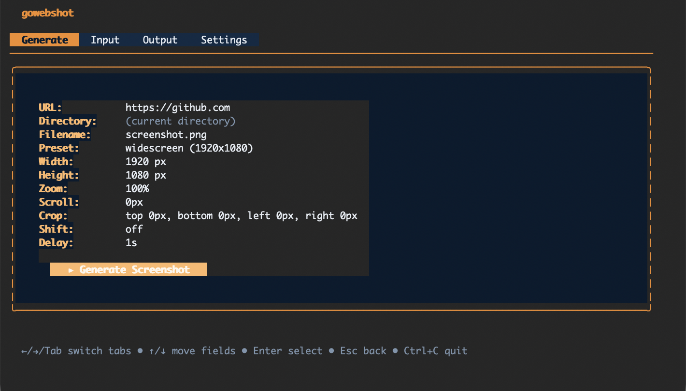

  
 
 
# gowebshot

Simple command line application for capturing screen shots of webpages.

## Features

- **Non-interactive mode** — Capture a screenshot with a single command using CLI flags.
- **Interactive TUI mode** — Configure and capture screenshots interactively with a keyboard-driven interface.
- **Preset resolutions** — Choose from widescreen (1920×1080), desktop (1440×900), square (1200×1200), or portrait (1080×1350).
- **Custom viewport** — Edit width and height directly, or start from a preset.
- **Zoom, scroll, and delay** — Apply page zoom, vertical scroll, and a configurable post-load delay before capture.
- **Auto-naming** — Automatically appends numeric suffixes to prevent overwriting existing files.
- **Chrome auto-discovery** — Finds Chrome/Chromium automatically, or accepts an explicit path.
